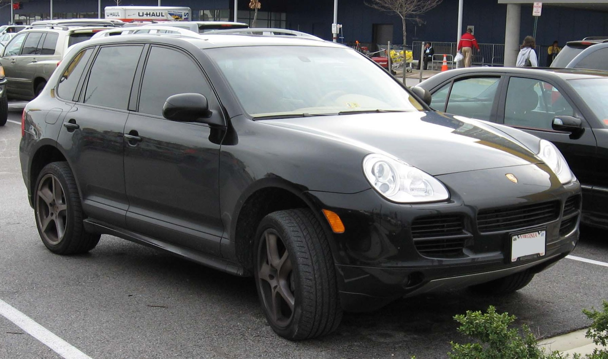
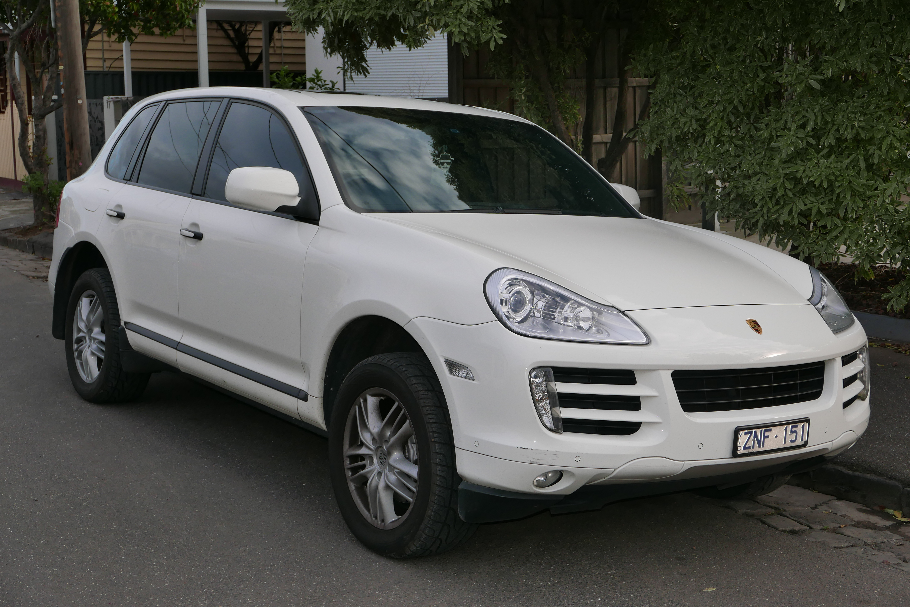
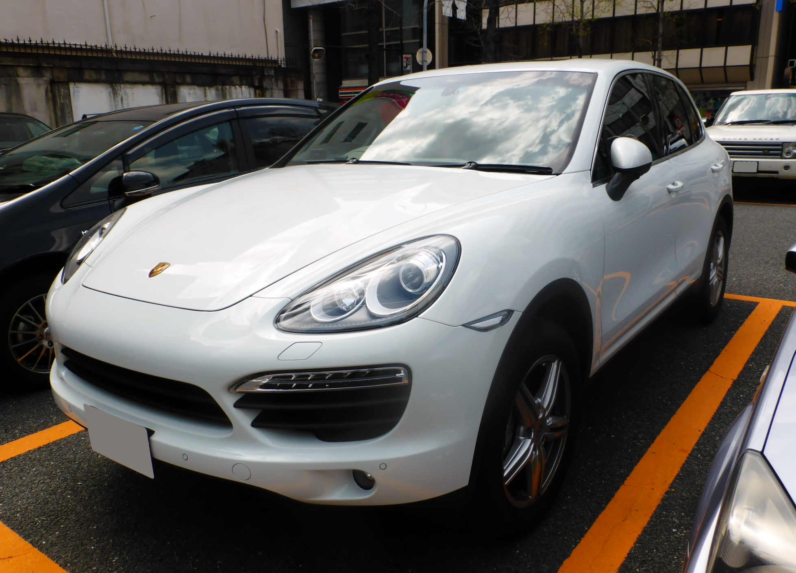
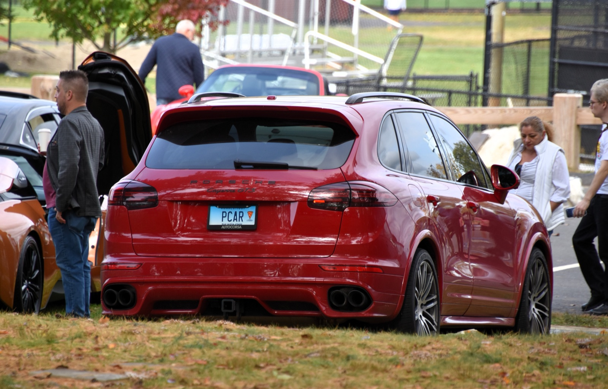

# Porsche Cayenne 955–958.2 — универсальная шпаргалка

**Версия:** 1.1

> **Охват:** Porsche Cayenne 955, 957, 958 и 958.2, прежде всего в конфигурациях, реально встречающихся на рынке РФ.
>
> **Цель:** по одному документу понять шильдик, двигатель, мощность, коробку, склонность к задирам, типовые проблемы, стоимость крупных ремонтов, регламент обслуживания, жидкости, топливо и PPI перед покупкой.
>
> **Важно:** заправочные объёмы и отдельные спецификации могут отличаться по VIN, рынку, модельному году, коду коробки/раздатки, наличию блокировки заднего дифференциала и PDCC. Перед покупкой жидкости финально сверять VIN/мануал/PET/PIWIS.

---

## Оглавление

- [Porsche Cayenne 955 — 2002–2006/начало 2007](#cayenne-955)
- [Porsche Cayenne 957 — 2007–2010](#cayenne-957)
- [Porsche Cayenne 958 — 2010–2014](#cayenne-958)
- [Porsche Cayenne 958.2 — 2014–2018](#cayenne-9582)
- [Коробки](#transmissions)
- [Регламент обслуживания](#maintenance)
- [Масла ДВС: допуски, вязкости и объёмы](#engine-oil)
- [Остальные жидкости](#fluids)
- [Топливо](#fuel)
- [PPI перед покупкой](#ppi)
- [Шкала стоимости ремонтов](#repair-costs)
- [Короткая карта всей линейки](#quick-map)
- [Источники и подход к данным](#sources)
- [TL;DR](#tldr)

---

# Porsche Cayenne 955 — 2002–2006/начало 2007

  

Фото: <a href="https://commons.wikimedia.org/wiki/File:Porsche-Cayenne.jpg">IFCAR / Wikimedia Commons</a> — Public Domain.

| Название | Мотор | Код мотора | Мощность | Коробка | Код КПП | Задиры | 💸 |
|---|---|---|---:|---|---|---|---|
| **Cayenne** | **3.2 VR6 бензин, атмо** | **M02.2Y** | **250 л.с.** | 6AT Aisin TR-60SN / 09D | **A48.20** | 🟢 Не характерны | 🟢 |
| **Cayenne S** | **4.5 V8 бензин, атмо** | **M48.00** | **340 л.с.** | 6AT Aisin TR-60SN / 09D | **A48.00** | 🔴 **Очень характерны** | 🔴 |
| **Cayenne Turbo** | **4.5 V8 бензин, biturbo** | **M48.50** | **450 л.с.** | 6AT Aisin TR-60SN / 09D | **A48.50** | 🟠 Бывают | 🔴 |
| **Cayenne Turbo S** | **4.5 V8 бензин, biturbo** | **M48.50S/T** | **521 л.с.** | 6AT Aisin TR-60SN / 09D | **A48.50** | 🟠 Бывают | ☠️ |

## Что здесь происходит

### 3.2 VR6 250

Это фактически родственник фольксвагеновского VR6. **Самый спокойный двигатель 955.**

Главное: цепи на большом пробеге, помпа/термостат/пластиковые элементы охлаждения, катушки, клапанная вентиляция. Цепи находятся неудобно, поэтому если дошло до них — дешёвым ремонт уже не будет.

Но фундаментально здесь важна другая вещь: **чугунный блок VR6 не имеет классической болезни Alusil-задиров M48**.

Проблема другая: 250 сил для тяжёлого первого Cayenne — не особо весело, а топлива он всё равно ест как взрослый.

**Итог:** если хочется старый Cayenne и не хочется сразу знакомиться со всеми мотористами города — один из лучших 955.

### 4.5 S 340

Вот тут начинается классический старый Cayenne.

Основные вещи:

- задиры цилиндров;
- знаменитые пластиковые трубки охлаждения в развале V8;
- стартер, который живёт там же в жаре;
- помпа/термостат;
- катушки;
- течи клапанных крышек;
- бензонасосы.

M48.00 считается одним из наиболее проблемных Cayenne-моторов по bore scoring; при задранных цилиндрах постоянное решение — капитальный ремонт блока, а не присадка или «масло погуще».

**Этот мотор без эндоскопии вообще не рассматриваем.**

### Turbo / Turbo S 4.5

Мотор родственник S, но вдобавок получаем две турбины, больше тепла, более дорогую систему охлаждения, более дорогие тормоза и шасси.

M48.50 также Alusil и также подвержен задирам; дополнительно известны течи турбинных магистралей и возрастные проблемы самих турбин.

При этом исправный Turbo — великолепная машина. Но сегодня это уже случай:

> «Я купил Porsche Turbo за миллион» ≠ «я владею автомобилем стоимостью миллион».

По стоимости содержания это всё ещё Porsche Turbo, просто двадцатилетний.

### Сам Cayenne 955

Кроме двигателя постоянно держим в голове **опору кардана, сам кардан, пневму, компрессор, старую электрику, охлаждение, рычаги и ступичные**.

Шестиступенчатый Aisin сам по себе достаточно крепкий. Гидроблок, соленоиды и гидротрансформатор с возрастом бывают, но обычно АКПП здесь далеко не самый страшный агрегат.

## Что реально приезжает, когда и сколько готовить

### Cayenne 3.2 M02.2Y

**Примерно 80–150 тыс. км:** помпа, термостат, PCV, катушки, различные пластиковые элементы охлаждения.

**Примерно 180–250+ тыс. км:** цепи, направляющие, натяжители, отклонения фаз.

Цифры условные: на двадцатилетнем Cayenne история обслуживания куда важнее цифры одометра.

**Деньги:**

- катушки/PCV/мелкие течи: **15–50 тыс. ₽**;
- охлаждение: **30–80 тыс. ₽**;
- полноценный заход в цепи: **150–300 тыс. ₽**.

**Ремонтопригодность: 🟢 высокая.**

### Cayenne S 4.5 M48.00

У задиров **нет честного пробега «после которого начинаются»**. Покупать машину по логике «всего 90 тысяч, значит цилиндры идеальны» нельзя.

Правильная диагностика — **эндоскоп цилиндров на холодном двигателе** плюс внимание к стуку, расходу масла, разнице выхлопа по банкам и металлу в масле.

Если эндоскоп показал задиры, мотор не выбрасывается: M48 давно гильзуют и капиталят.

**Ориентир:**

- пластиковые магистрали/охлаждение: **50–150 тыс. ₽**;
- большой ГРМ/фазы: **150–300+ тыс. ₽**;
- хорошая капиталка: **примерно 500–800 тыс. ₽**;
- большая дефектовка с ГБЦ, фазами, поршневой и сопутствующим: **800 тыс.–1 млн+ ₽**.

**Ремонтопригодность: 🟡 технически хорошая, экономически спорная.**

### Turbo / Turbo S M48.50

Помимо цилиндров получаем две турбины и их магистрали.

В зоне **120–200+ тыс. км** вероятность вмешательства в турбосистему становится реальной, но возраст и история важнее самого пробега.

**Ориентир:**

- магистрали/локальная работа: **30–100 тыс. ₽**;
- серьёзный ремонт пары турбин: **150–300+ тыс. ₽**;
- капиталка двигателя: **600–900 тыс. ₽**;
- двигатель + турбины + ГБЦ + сопутствующее: **1 млн ₽ и выше**.

**Ремонтопригодность: 🟡.** Ничего мистического. Просто дорого всё сразу.

### Общие болезни 955

**Кардан/подвесной:** вибрации, удары, гул. Обычно проблема решаемая и по меркам Porsche не страшная.

**Пневма:** компрессор, баллоны, клапанный блок. Всё давно восстанавливается.

**Aisin 6AT:** на больших пробегах гидроблок, соленоиды, ГДТ. Полноценный ремонт может стоить **150–250+ тыс. ₽**, но сама коробка нормальная и ремонтопригодная.

### Рейтинг 955

**3.2 → лучший рациональный.**

**4.5 S → потенциально самый опасный.**

**Turbo → игрушка с большим резервом денег.**

**Turbo S → коллекционная игрушка для человека, которому не нужно считать стоимость ремонта.**

---

# Porsche Cayenne 957 — 2007–2010

  

Фото: <a href="https://commons.wikimedia.org/wiki/File:2009_Porsche_Cayenne_(9PA_MY09)_3.6_wagon_(2015-07-16)_01.jpg">OSX / Wikimedia Commons</a> — Public Domain.

| Название | Мотор | Код мотора | Мощность РФ | Коробка | Код КПП | Задиры | 💸 |
|---|---|---|---:|---|---|---|---|
| **Cayenne** | **3.6 VR6 бензин, атмо FSI** | **M55.01** | **290 л.с.** | 6AT Aisin TR-60SN / 09D | **A48.22** | 🟢 Не характерны | 🟢 |
| **Cayenne Diesel** | **3.0 V6 дизель, turbo** | **M05.9D** | **240 л.с.** | 6AT Aisin TR-60SN / 09D | **A05.9D** | 🟢 Не типовая проблема | 🟢/🟡 |
| **Cayenne S** | **4.8 V8 бензин, атмо DFI** | **M48.01** | **385 л.с.** | 6AT Aisin TR-60SN / 09D | **A48.02** | 🟡 Возможны | 🟡/🟠 |
| **Cayenne GTS** | **4.8 V8 бензин, атмо DFI** | **M48.01** | **405 л.с.** | 6AT Aisin TR-60SN / 09D | **A48.02** | 🟡 Возможны | 🟠 |
| **Cayenne Turbo** | **4.8 V8 бензин, biturbo** | **M48.51** | **500 л.с.** | 6AT Aisin TR-60SN / 09D | **A48.52** | 🟡 Возможны | 🔴 |
| **Cayenne Turbo S** | **4.8 V8 бензин, biturbo** | **M48.51** | **550 л.с.** | 6AT Aisin TR-60SN / 09D | **A48.52** | 🟡 Возможны | ☠️ |

## 957 заметно лучше 955

### 3.6 VR6 290

На мой взгляд, **один из самых здравых старых Cayenne вообще**.

Это уже непосредственный впрыск, поэтому добавляются нагар на впускных клапанах, топливная система высокого давления, PCV, цепи на больших пробегах и помпа/термостат.

Но катастрофического конструктивного порока тут нет, а чугунный VR6 не является тем самым «задирным Porsche-мотором».

### 3.0 Diesel 240

Первый дизельный Cayenne. Типичный старый VAG 3.0 TDI:

- EGR;
- DPF;
- вихревые заслонки;
- топливная;
- турбина;
- цепи на очень больших пробегах.

Проблема в 2026 году уже не столько в конструкции, сколько в возрасте автомобиля.

### 4.8 S/GTS

Porsche заметно доработал V8 по сравнению с 955. У 4.8 уже нет именно того кошмара с пластиковыми магистралями 4.5, хотя появились свои места утечек охлаждения, ТНВД, PCV и прямой впрыск.

Но **4.8 M48.01 всё равно Alusil и способен задираться**.

**S = 385 л.с.**

**GTS = 405 л.с.**

И редчайшая механика на GTS действительно существовала.

### Turbo / Turbo S

**Turbo = 500 л.с.**

**Turbo S = 550 л.с.**

4.8 biturbo зрелее 4.5 Turbo, но содержание всё равно не имеет никакого отношения к нынешней цене машины.

## Что реально приезжает, когда и сколько стоит

### M55.01 3.6

**80–150 тыс. км:** PCV, катушки, помпа/термостат, нагар, датчики и топливная мелочь.

**180–250+ тыс. км:** цепи, башмаки, натяжители, фазы.

**Деньги:**

- чистка впуска: **30–60 тыс. ₽**;
- охлаждение/PCV: **30–80 тыс. ₽**;
- цепи: **180–300 тыс. ₽**.

**Ремонтопригодность: 🟢.**

### M05.9D 3.0 Diesel

**До ~150 тыс. км:** EGR, заслонки, мелкие течи, датчики, впуск.

**150–250 тыс. км:** DPF, турбина, форсунки, ТНВД, цепи.

**Деньги:**

- EGR/впуск/мелочь: **20–80 тыс. ₽**;
- турбина или серьёзная топливная работа: **70–200 тыс. ₽**;
- цепной привод: **180–300+ тыс. ₽**.

**Ремонтопригодность: 🟢/🟡.**

### M48.01 S/GTS

Типовые истории:

- задиры;
- нагар;
- ТНВД;
- PCV;
- катушки;
- помпа/термостат;
- фазорегуляторы;
- цепи.

По цилиндрам нет магической отсечки в 100 или 150 тысяч. **Эндоскоп нужен независимо от красивого пробега.**

**Деньги:**

- обычная крупная неисправность: **50–150 тыс. ₽**;
- фазы/ГРМ: **200–350+ тыс. ₽**;
- полноценный задирный мотор: **600–900 тыс. ₽**.

**Ремонтопригодность: 🟡.**

### M48.51 Turbo / Turbo S

Всё то же плюс две турбины, масляные/антифризные линии, интеркулеры, катализаторы и ещё больше тепла.

Большой заход без капиталки: **200–400 тыс. ₽**.

Задиры + турбины + большая дефектовка: **800 тыс.–1 млн+ ₽**.

**Ремонтопригодность: 🟡, стоимость: 🔴.**

### Если брать 957

**3.6 VR6 ≈ 3.0 Diesel → S/GTS → Turbo → Turbo S.**

Ухоженный GTS — очень интересный автомобиль именно как олдовый атмосферный V8 Porsche.

---

# Porsche Cayenne 958 — 2010–2014

  

Фото: <a href="https://commons.wikimedia.org/wiki/File:Porsche_958_Cayenne_S_front.JPG">Tokumeigakarinoaoshima / Wikimedia Commons</a> — CC0 1.0.

| Название | Мотор | Код мотора | Мощность РФ | Коробка | Код КПП | Задиры | 💸 |
|---|---|---|---:|---|---|---|---|
| **Cayenne** | **3.6 VR6 бензин, атмо** | **M55.02** | **300 л.с.** | 8AT Aisin Tiptronic | **A55.04** | 🟢 Не характерны | 🟢 |
| **Cayenne Diesel ранний** | **3.0 V6 дизель, turbo** | **M05.9E / MCN.RB** | **240 л.с.** | 8AT Aisin | **A59.04** | 🟢 | 🟢 |
| **Cayenne Diesel** | **3.0 V6 дизель, turbo** | **MCR.CA** | **245 л.с.** | 8AT Aisin | **A59.04** | 🟢 | 🟢 |
| **Cayenne S Hybrid** | **3.0 V6 бензин, compressor + EV** | **M06.EC / MCG.E** | **380 л.с. системно** | 8AT Hybrid | **A06.04** | 🟡 Не главная проблема | 🟠 |
| **Cayenne S** | **4.8 V8 бензин, атмо** | **M48.02** | **400 л.с.** | 8AT Aisin | **A48.04** | 🟠 Бывают | 🟠 |
| **Cayenne GTS** | **4.8 V8 бензин, атмо** | **M48.02** | **420 л.с.** | 8AT Aisin | **A48.04/05** | 🟠 Бывают | 🟠 |
| **Cayenne S Diesel** | **4.134 V8 дизель, biturbo** | **MCU.DB** | **382 л.с.** | 8AT Aisin | **A57.04** | 🟢 Не характерны | 🟠 |
| **Cayenne Turbo** | **4.8 V8 бензин, biturbo** | **M48.52** | **500 л.с.** | 8AT Aisin | **A48.54** | 🟠 Бывают | 🔴 |
| **Cayenne Turbo S** | **4.8 V8 бензин, biturbo** | **M48.52** | **550 л.с.** | 8AT Aisin | **A48.54** | 🟠 Бывают | ☠️ |

## Здесь начинается современный Cayenne

### Cayenne 3.6 300

Снова VR6 и снова очень рациональный бензиновый Cayenne. Он не быстрый по меркам Porsche, но двигатель простой относительно остальной линейки.

Основные истории — нагар непосредственного впрыска, пластик охлаждения, PCV, катушки/помпа и цепи ближе к большим пробегам.

Если не нужен дизель — это практически ответ на вопрос «какой 958 купить, чтобы было меньше потенциального пиздеца».

### Cayenne Diesel 240/245

Здесь Porsche практически нашёл формулу идеального массового 958.

3.0 V6 TDI:

- тяговитый;
- умеренно ест;
- хорошо сочетается с 8AT;
- огромная база запчастей VAG;
- не превращает каждую поездку в ожидание задиров V8.

Возраст приносит EGR/DPF, вихревые заслонки, уплотнения и течи в развале, охлаждение, топливную аппаратуру и цепи при серьёзных пробегах.

**Один из лучших моторов всего семейства 958.**

### S Hybrid — 380

**3.0 V6 compressor + электромотор = 380 л.с. системно.**

Сам ДВС неплохой, но с возрастом добавляются HV-батарея, силовая электроника, отдельное охлаждение гибрида и специфическая трансмиссия.

Это **сложный автомобиль, который стареет сразу в двух мирах — ДВС и HV**.

### S 400 / GTS 420

Последние атмосферные V8 в обычных S/GTS.

**958 S = 4.8 / 400**  
**958 GTS = 4.8 / 420**

Звучат и едут великолепно, но Alusil никуда не исчез: семейство 4.8 M48 остаётся подверженным bore scoring.

### S Diesel 382

**4.134 V8 biturbo diesel, 382 л.с., 850 Нм.**

Мотор серьёзный и ресурсный. Проблема не «он плохой», а то, что сложный дизельный V8 ремонтируется по бюджету V8 Porsche/Audi, а не обычного 3.0 TDI.

## Что реально приезжает, когда и сколько стоит

### Base M55.02

**80–150 тыс. км:** PCV, помпа, термостат, катушки, нагар, топливная мелочь.

**180–220+ тыс. км:** цепи становятся реальным вопросом.

**Деньги:**

- обычные неисправности: **20–80 тыс. ₽**;
- цепи: **180–300 тыс. ₽**.

**Ремонтопригодность: 🟢.**

### Diesel M05.9E / MCR.CA

**80–150 тыс. км:** EGR, заслонки, впуск, термостат, теплообменник, масло по уплотнениям.

**150–220 тыс. км:** DPF, турбина, форсунки, топливная аппаратура.

**200+ тыс. км:** цепи уже становятся серьёзным пунктом.

**Деньги:**

- EGR/впуск/локальная течь: **20–100 тыс. ₽**;
- большая работа в развале/охлаждении: **50–150 тыс. ₽**;
- турбина: **80–180 тыс. ₽**;
- серьёзная топливная: **100–250 тыс. ₽**;
- цепи: **180–300+ тыс. ₽**.

MCR.CA чаще постепенно просит отдельные ремонты по мере старения, чем внезапно ставит владельца перед необходимостью гильзовать цилиндры.

**Ремонтопригодность: 🟢.**

### S/GTS M48.02

Типичные истории:

- задиры;
- PCV;
- ТНВД;
- нагар;
- охлаждение;
- фазорегуляторы;
- цепи;
- течи.

**Маленький пробег не гарантирует отсутствие задиров.**

**Деньги:**

- обычная большая неисправность: **50–150 тыс. ₽**;
- ГРМ/фазы: **200–350+ тыс. ₽**;
- двигатель с задирами: **600–900 тыс. ₽** как разумный резерв.

**Ремонтопригодность: 🟡.**

### S Diesel MCU.DB

С возрастом приезжают EGR, DPF, впуск, две турбины, топливная, масло/антифриз и цепной привод.

Локальная проблема: **50–150 тыс. ₽**.

Комбинация «цепи + турбины + дизельная экология»: **300–500+ тыс. ₽**.

**Ремонтопригодность: 🟡/🟢.**

### S Hybrid

Главный вопрос — состояние **HV-системы**: батарея, силовая электроника, электромотор, преобразователь и охлаждение гибрида.

Перед покупкой нужна специализированная проверка высоковольтной части.

### Turbo / Turbo S M48.52

Alusil + две турбины.

Большой ремонт без вскрытия цилиндров: **200–400 тыс. ₽**.

Если добавляются задиры и большая дефектовка: **800 тыс.–1,2 млн+ ₽**.

## Главные болезни самого 958

### Раздатка

Очень известная болезнь: рывки, подёргивания и дрожь при плавном разгоне.

Сейчас это **освоенный ремонт**, а не приговор автомобилю. Разумный ориентир: **55–100 тыс. ₽** в зависимости от объёма работ.

### Пневма

Компрессор, стойки и клапанный блок ремонтируются.

Ориентиры:

- ремонт компрессора: **8–20 тыс. ₽**;
- восстановление стойки: **15–40 тыс. ₽ за штуку**.

### Редукторы

Передний и задний редукторы также ремонтопригодны. Крупная переборка обычно стоит **десятки тысяч**, а не цену автомобиля.

### 8AT Aisin

В целом **очень крепкая коробка**. При дрожи 958 первым делом нужно отделить АКПП от раздатки, карданов и редукторов.

### Итог по 958

**3.0D 245 / 3.6 300 — рационально.**  
**GTS 420 — прекрасный эмоциональный вариант.**  
**S Diesel — мощно и интересно, но обслуживание уже взрослое.**  
**Turbo — только с хорошим PPI и резервом денег.**

---

# Porsche Cayenne 958.2 — 2014–2018

  

Фото: <a href="https://commons.wikimedia.org/wiki/File:Porsche_Cayenne_GTS_(2016)_(54871040001).jpg">Charles / Wikimedia Commons</a> — CC0 1.0.

| Название | Мотор | Код мотора | Мощность РФ | Коробка | Код КПП | Задиры | 💸 |
|---|---|---|---:|---|---|---|---|
| **Cayenne** | **3.6 VR6 бензин, атмо** | **M55.02** | **300 л.с.** | 8AT Aisin | **A55.04** | 🟢 Не характерны | 🟢 |
| **Cayenne Diesel** | **3.0 V6 дизель, turbo** | **MCR.CA** | **245 л.с. РФ** | 8AT Aisin | **A59.04** | 🟢 Не характерны | 🟢🟢 |
| **Cayenne S E-Hybrid** | **3.0 V6 бензин, compressor + EV** | **M06.EC / MCG.EA/FA** | **416 л.с. системно** | 8AT Hybrid | **A06.04** | 🟡 Не главная проблема | 🟠/🔴 |
| **Cayenne S** | **3.6 V6 бензин, biturbo** | **MCU.RA** | **420 л.с.** | 8AT Aisin | **A48.04** | 🟠 **Да, бывают** | 🟠 |
| **Cayenne GTS** | **3.6 V6 бензин, biturbo** | **MCX.ZA** | **440 л.с.** | 8AT Aisin | **A48.05** | 🟠 **Да, бывают** | 🟠/🔴 |
| **Cayenne S Diesel** | **4.134 V8 дизель, biturbo** | **MCU.DC** | **385 л.с.** | 8AT Aisin | **A57.04** | 🟢 Не характерны | 🟠 |
| **Cayenne Turbo** | **4.8 V8 бензин, biturbo** | **MCF.TB** | **520 л.с.** | 8AT Aisin | **A48.54** | 🟠/🔴 Бывают | 🔴 |
| **Cayenne Turbo S** | **4.8 V8 бензин, biturbo** | **MCY.XA** | **570 л.с.** | 8AT Aisin | **A48.54** | 🟠/🔴 Бывают | ☠️ |

## Самая важная вещь про 958.2

**Cayenne 3.6 300 и Cayenne S 3.6 420 имеют только одинаковый объём.**

**M55.02 300** — Volkswagen VR6, атмосферный, чугунный блок.

**MCU.RA 420 / MCX.ZA 440** — Porsche V6, алюминиевый, две турбины.

Поэтому:

> **958.2 3.6 300 Base — VR6, классическая задирная болезнь не характерна.**

> **958.2 S/GTS 420/440 — совершенно другой V6 biturbo, эндоскоп нужен.**

### Cayenne Diesel 3.0 MCR.CA 245

Конфигурация:

**Cayenne Diesel 958.2 → 3.0 V6 TDI → MCR.CA → 245 л.с. РФ → A59.04 → восьмиступенчатый Aisin Tiptronic S.**

Это одна из наиболее рациональных версий 958.2 с точки зрения сочетания ресурса, динамики, расхода топлива и потенциальной стоимости ремонта.

Классическая для бензиновых Porsche M48/MCT проблема Alusil-задиров здесь **не характерна**.

Возрастные истории:

- EGR;
- DPF;
- впуск и вихревые заслонки;
- течи масла и антифриза;
- теплообменник;
- охлаждение;
- топливная аппаратура;
- турбокомпрессор;
- цепной привод на больших пробегах.

### Base 3.6 300

Атмосферный VR6 — пожалуй, **самый безопасный бензиновый 958.2**, если динамика устраивает.

### S 420 / GTS 440

Главный рестайлинговый переворот:

**Дорест:** S 4.8 V8 400 / GTS 4.8 V8 420.

**Рест:** S 3.6 V6 biturbo 420 / GTS 3.6 V6 biturbo 440.

То есть:

> Cayenne S 2016, 420 л.с. = **не V8**.

А:

> GTS 2013, 420 л.с. = **4.8 атмосферный V8**.

### S E-Hybrid 416

**3.0 V6 compressor + электромотор = 416 системных сил.**

Покупать имеет смысл только после нормальной HV-диагностики.

### S Diesel 385

**4.134 / 385 л.с. / 850 Нм.**

Не задирный в классическом смысле M48, но всё вокруг огромное, сложное и дорогое.

### Turbo 520 / Turbo S 570

**Turbo = 4.8 V8 TT / 520**  
**Turbo S = 4.8 V8 TT / 570**

Здесь уже бессмысленно обсуждать «надёжный ли мотор» отдельно от бюджета владельца.

## Что реально приезжает, когда и сколько стоит

### Base M55.02

**80–150 тыс. км:** PCV, нагар, катушки, помпа, термостат, пластиковая система охлаждения.

**180–220+ тыс. км:** цепи.

**Деньги:**

- мелочь/охлаждение: **20–80 тыс. ₽**;
- ГРМ: **180–300 тыс. ₽**.

**Ремонтопригодность: 🟢.**

### Diesel MCR.CA 245

**80–150 тыс. км:** EGR, заслонки, впуск, масло по уплотнениям, теплообменник, термостат, датчики.

**150–220 тыс. км:** DPF, турбина, форсунки, топливная аппаратура.

**200+ тыс. км:** цепи становятся реальным потенциальным большим ремонтом.

**Деньги:**

- обычная возрастная проблема: **20–100 тыс. ₽**;
- большая течь/разборка: **50–150 тыс. ₽**;
- турбина/топливная: **100–250 тыс. ₽**;
- цепи: **180–300+ тыс. ₽**.

**Ремонтопригодность: 🟢.**

Архитектура 3.0 V6 TDI широко распространена в VAG, запчастей и специалистов много.

### S MCU.RA / GTS MCX.ZA

Помимо потенциальных задиров:

- PCV;
- нагар;
- ТНВД;
- катушки;
- охлаждение;
- течи масла;
- турбины;
- цепи.

После **120–150+ тыс. км** вероятность нескольких возрастных работ одновременно заметно увеличивается, но задиры не имеют установленного порога пробега.

**Деньги:**

- локальная проблема: **50–150 тыс. ₽**;
- турбины/топливная/ГРМ: **150–350 тыс. ₽**;
- серьёзный цилиндровый ремонт: **500–800+ тыс. ₽**.

**Ремонтопригодность: 🟡.**

### S Diesel MCU.DC

Типовые истории: EGR, DPF, впуск, две турбины, топливная, масло/антифриз, цепи.

Локальная неисправность: **50–150 тыс. ₽**.

Большой заход в несколько систем одновременно: **200–500+ тыс. ₽**.

**Ремонтопригодность: 🟡/🟢.**

### S E-Hybrid 416

Главный фактор риска с возрастом:

- состояние HV-батареи;
- силовая электроника;
- компрессорный ДВС;
- электромотор;
- отдельное охлаждение.

Здесь бессмысленно оценивать автомобиль только по ДВС.

### Turbo MCF.TB / Turbo S MCY.XA

Последние 4.8 biturbo.

Проблемы: задиры, турбины, масляные/антифризные линии, топливная, фазы, цепи, катализаторы, высокая тепловая нагрузка.

**200–400 тыс. ₽** за серьёзный ремонт без капиталки здесь не выглядит необычным.

Если цилиндры требуют вмешательства — **800 тыс.–1,2 млн+ ₽** как резерв уже адекватная психология владельца.

---

# Коробки — чтобы окончательно закрепить

| Поколение | Основной автомат |
|---|---|
| **955** | 6AT Aisin **TR-60SN / VAG 09D**, Porsche A48.xx |
| **957** | 6AT Aisin **TR-60SN / 09D**, Porsche A48.xx/A05.9D |
| **958** | 8AT Aisin Tiptronic S / семейство **0C8**, Porsche A55/A59/A48/A57/A06 по версии |
| **958.2** | 8AT Aisin Tiptronic S / семейство **0C8**, те же семейства Porsche-кодов по мотору |

**Никаких PDK/DSG на 955/957/958/958.2 нет.** Это классические гидротрансформаторные автоматы.

---

# Регламент обслуживания

## Заводской регламент и разумный регламент возрастного Cayenne

Заводские интервалы Porsche иногда очень длинные. Для части 958 заводской чек-лист относит ATF, фильтр Tiptronic, масло раздатки и дифференциалов к **240 000 км / 16 годам**, а тормозную жидкость — к **2 годам**. Для возрастной машины разумно обслуживать трансмиссию существенно чаще.

| Работа | Практический интервал |
|---|---|
| **Масло ДВС + фильтр, бензин** | **7–10 тыс. км / 1 год** |
| **Масло ДВС + фильтр, Turbo/GTS** | **7–8 тыс. км / 1 год** |
| **Масло ДВС + фильтр, дизель** | **8–10 тыс. км / 1 год** |
| **Воздушный фильтр** | **20–30 тыс. км**, чаще при пыли |
| **Салонный фильтр** | **15–20 тыс. км / 1 год** |
| **Топливный фильтр дизеля** | **30–40 тыс. км** |
| **Свечи 957 Base 3.6** | заводской ориентир **60 тыс. км / 4 года** |
| **Свечи 957 S/GTS** | заводской ориентир **30 тыс. км / 4 года** |
| **Свечи 957 Turbo/Turbo S** | заводской ориентир **20 тыс. км / 4 года** |
| **Свечи 958/958.2 атмосферные/S/GTS/Hybrid** | ориентир **40–60 тыс. км / 4 года**, сверять конкретную версию |
| **Свечи Turbo** | ориентир **30–45 тыс. км / 4 года** |
| **Тормозная жидкость** | **каждые 2 года** |
| **ATF 6AT 955/957** | практически **50–60 тыс. км** |
| **ATF 8AT 958/958.2** | практически **60–80 тыс. км** |
| **Раздатка 955/957** | **50–60 тыс. км** |
| **Раздатка 958/958.2** | **40–60 тыс. км**, особенно при первых симптомах дрожи |
| **Передний/задний редуктор** | **60–80 тыс. км** |
| **PDCC** | проверка уровня/течей при каждом большом ТО; резервуар отдельных версий — около **90 тыс. км / 6 лет** |
| **Приводной ремень** | осмотр каждое ТО; профилактически **60–90 тыс. км / 6 лет** |
| **Ремень компрессора Hybrid** | ориентир **90 тыс. км / 6 лет** |
| **Антифриз** | контроль ежегодно; при неизвестной истории/ремонте системы заменить; профилактически **4–5 лет** разумно |
| **DPF дизеля** | не менять «по пробегу»: смотреть soot/ash load и дифференциальное давление |
| **Цепи ГРМ** | фиксированного интервала нет: контроль по шуму, фазам и диагностике |

## Нулевое ТО после покупки машины с неизвестной историей

1. Масло ДВС + фильтр.
2. Воздушный и салонный фильтры.
3. На дизеле — топливный фильтр.
4. Тормозная жидкость.
5. ATF + фильтр/поддон, если нет подтверждённой недавней замены.
6. Масло раздатки.
7. Масла обоих редукторов.
8. Проверка состояния антифриза; при сомнениях полная замена.
9. Свечи бензинового мотора, если история неизвестна.
10. Полный PIWIS-скан.
11. Ремни/ролики.
12. Дренажи люка и водоотводы.
13. АКБ и зарядка генератора.
14. Проверка уровня/утечек PDCC и ГУР.
15. На дизеле — DPF/EGR/коррекции форсунок.

---

# Масла ДВС: что лить, допуски и объёмы

## Главное правило

**Допуск важнее бренда и важнее самой надписи 0W-40 / 5W-30.**

### Porsche A40

Типичный выбор для бензиновых V8 Porsche и ряда других бензиновых версий.

Практичные вязкости:

- **0W-40**
- **5W-40**

### Porsche C30 / VW 504 00 / VW 507 00

Используется на VAG-архитектуре V6/VR6 и дизелях с DPF в соответствующих поколениях.

Практичные вязкости:

- **5W-30**
- **0W-30**, если конкретный продукт имеет необходимый допуск.

## Ориентиры по двигателям

| Версия | Основной допуск | Практичная вязкость | Объём с фильтром, ориентир |
|---|---|---|---:|
| **955 3.2 VR6** | **Porsche C30** | **5W-30** | **≈6.3 л** |
| **955 S/Turbo 4.5** | **Porsche A40** | **0W-40 / 5W-40** | **≈8.5–9.0 л** |
| **957 3.6 VR6** | **Porsche C30** | **5W-30** | **≈6.9 л** |
| **957 3.0 Diesel** | **Porsche C30 / VW 507 00** | **5W-30** | **≈7.5–8.3 л** |
| **957 4.8 S/GTS/Turbo** | **Porsche A40** | **0W-40 / 5W-40** | **≈9.0 л** |
| **958 3.6 VR6** | **Porsche C30** | **5W-30** | **≈6.9 л** |
| **958 3.0 Diesel 2013–2014** | **Porsche C30 / VW 507 00** | **5W-30 / 0W-30** | **≈7.3 л** |
| **958 S Hybrid 3.0** | **Porsche C30** | **5W-30** | **≈6.25–6.8 л** |
| **958 S/GTS/Turbo 4.8** | **Porsche A40** | **0W-40 / 5W-40** | **≈9.5 л** |
| **958 S Diesel 4.1** | **Porsche C30 / VW 507 00** | **5W-30 / 0W-30** | **около 9 л**, сверять VIN |
| **958.2 Base 3.6** | **Porsche C30** | **5W-30** | **≈6.8 л** |
| **958.2 Diesel 3.0 2015–2016** | **Porsche C30 / VW 507 00** | **5W-30 / 0W-30** | **≈7.7 л** |
| **958.2 S/GTS 3.6TT** | **Porsche A40** | **0W-40 / 5W-40** | **≈8.5 л** |
| **958.2 S E-Hybrid 3.0** | **Porsche C30** | **5W-30** | **≈6.25 л после соответствующей сервисной кампании; сверять VIN** |
| **958.2 S Diesel 4.1** | **Porsche C30 / VW 507 00** | **5W-30 / 0W-30** | **около 9 л**, сверять VIN |
| **958.2 Turbo/Turbo S 4.8** | **Porsche A40** | **0W-40 / 5W-40** | **≈9.5 л** |

> **Объём — ориентир, не команда «залить всё сразу».** Заливать ступенчато и выставлять уровень штатной процедурой.

## Нормальные бренды

### A40

Если на **конкретной канистре** есть действующий Porsche A40:

- **Mobil 1 FS 0W-40**
- **Mobil 1 FS 5W-40**
- **Motul 8100 X-Cess Gen2 5W-40**
- **Ravenol VST 5W-40**
- **Ravenol SSL 0W-40**

### C30 / VW 504 00 507 00

Если на конкретной канистре есть нужный approval:

- **Mobil 1 ESP 5W-30**
- **Mobil 1 ESP 0W-30**
- **Ravenol VMP 5W-30**
- **Motul Specific 504 00 507 00 5W-30**
- **Motul Specific 504 507 0W-30**
- **Shell Helix Ultra Professional AV-L 5W-30**

**Не переходить на A40 в дизеле с DPF только потому, что оно «погуще».**

---

# Остальные жидкости

## АКПП 955/957 — Aisin TR-60SN / 09D

**Спецификация:** JWS 3309.

Нормальные варианты:

- оригинальная Porsche/VAG жидкость по VIN;
- **Mobil ATF 3309**;
- **Ravenol T-IV Fluid** при прямом соответствии JWS 3309;
- аналог только с явным соответствием JWS 3309.

**Полная ёмкость:** примерно **9–10 л**; сервисная замена обычно меньше.

## АКПП 958/958.2 — Aisin 0C8

Ориентироваться на **оригинальную Porsche/VAG спецификацию конкретного кода коробки**. Для семейства 0C8 применяется жидкость соответствующей ревизии Aisin/Porsche; подбирать по VIN.

Нормальные варианты:

- оригинал Porsche/VAG по VIN;
- Aisin-жидкость только при прямом соответствии конкретной спецификации коробки;
- качественный аналог только с явным соответствием нужной спецификации.

Для сервисной замены часто требуется порядка **8–10 л**, но точный объём зависит от метода замены и исполнения.

Уровень выставляется **по температуре ATF**, а не по принципу «сколько слилось, столько залил».

## Раздатка 955/957

Ориентировочный объём: **около 0.85 л**.

Использовать жидкость Porsche по VIN. Не подменять жидкость раздатки случайным ATF.

## Раздатка 958/958.2

**Критически важно:** на 958 нет одной жидкости на все версии.

На части версий применяется специальная жидкость активной раздатки; у Diesel/Hybrid и отдельных исполнений спецификация может отличаться.

> **Масло раздатки 958 всегда подбирать по VIN/коду агрегата.**

Ориентировочный объём многих версий — **около 0.8–0.9 л**.

## Передний и задний редукторы

Типично используется трансмиссионное масло класса **75W-90 GL-5**, но наличие блокировки заднего дифференциала меняет требования.

Ориентиры 955/957 из мануалов:

- передний: **≈1.0 л**;
- задний обычный: **≈1.4 л**;
- задний с блокировкой: **≈1.6 л**.

На 958/958.2 объём и спецификацию сверять по конкретному агрегату.

Нормальные бренды при нужной спецификации:

- **Ravenol**
- **Motul Gear 300**
- **Liqui Moly**
- **Porsche/VAG Original**

## Антифриз

**Нельзя выбирать по цвету.**

Правильный алгоритм:

1. определить требуемую Porsche/VAG спецификацию по VIN;
2. если залито неизвестно что — не смешивать вслепую;
3. при полной замене промыть систему;
4. использовать оригинальный Porsche coolant либо продукт с прямым соответствием требуемой спецификации.

Система большая: по 955/957 заводские данные дают примерно **13–18 л для V6** и **18–21 л для V8** в зависимости от комплектации.

После полного слива желательно вакуумное заполнение.

## Тормозная жидкость

**DOT 4**, замена **каждые 2 года**.

Нормальные варианты:

- **Porsche Original Brake Fluid**
- **ATE DOT 4 / SL.6**, если подходит требуемая вязкость
- **Motul DOT 4**
- **Brembo DOT 4**

## ГУР / гидросистемы

Для 955/957 заводская документация указывает **Pentosin CHF 202 S**, объём ГУР порядка **1.5 л**.

Также в VAG/Porsche-гидросистемах встречается CHF 11S/CHF 202 — конкретную жидкость сверять по VIN и маркировке бачка.

**Обычный красный ATF в бачок ГУР не лить.**

---

# Топливо

## Бензиновые Cayenne

Для 955/957 заводские руководства прямо указывают:

- **98 RON — рекомендовано для оптимальной мощности и расхода;**
- **95 RON — допустимый минимум**, ЭБУ адаптирует угол зажигания.

Практическая логика для 955–958.2:

| Топливо | Вердикт |
|---|---|
| **АИ-92** | ❌ **Не использовать как штатное топливо** |
| **АИ-95** | 🟡 **Допустимо**, особенно Base; при высокой нагрузке хуже 98 |
| **АИ-98** | 🟢 **Основной рекомендуемый выбор** |
| **АИ-100** | 🟢 **Можно**, вреда качественное топливо не несёт; на штатной прошивке огромной прибавки мощности не будет |

Для **S/GTS/Turbo/Turbo S** постоянный выбор — **98**, а при качественном топливе 100 тоже абсолютно нормален.

Для базовых VR6 **95 допустим**, 98 предпочтителен.

### Hybrid / E-Hybrid

Для компрессорного 3.0 — **не ниже 95 RON**; 98 также нормален и предпочтителен при высокой нагрузке.

## Дизель

Все дизельные Cayenne заправлять **качественным малосернистым ДТ стандарта EN 590 / российского класса К5**, обязательно сезонным:

- летнее;
- зимнее;
- арктическое при соответствующей температуре.

Не использовать ДТ неизвестного происхождения.

## Экологический класс дизельных версий

| Версия | Типичный экологический класс |
|---|---|
| **957 Diesel 3.0 240** | **Euro 4** |
| **958 Diesel 3.0 240/245** | **Euro 5** |
| **958 S Diesel 4.1 382** | **Euro 5** |
| **958.2 Diesel 3.0, российская версия 245** | **проверять VIN/ПТС/сертификат: российская спецификация отличается от европейской** |
| **958.2 европейский Diesel 262** | **Euro 6** |
| **958.2 S Diesel 385** | **Euro 5 / Euro 6 в зависимости от рынка и сертификации** |

> **Экологический класс автомобиля ≠ класс дизтоплива.** Даже Euro 4 сейчас разумно заправлять современным **К5 / EN 590**.

---

# PPI перед покупкой

## Обязательная база для любого Cayenne

### 1. Документы и история

- сверить VIN;
- история регистраций и ДТП;
- пробеги;
- заказ-наряды;
- подтверждение крупных работ;
- проверить, не «обнулена» ли история машины красивым одометром.

### 2. Только холодный запуск

Просить машину **не прогревать до приезда**.

На холодную слушать:

- цепи;
- гидрокомпенсаторы;
- поршневой стук;
- турбины;
- ровность работы.

### 3. PIWIS

Читать не только DME.

Минимум:

- DME/EDC;
- АКПП;
- раздатка;
- PSM;
- PASM/пневма;
- PDCC;
- климат;
- кузовные блоки;
- PCM;
- HV-блоки на Hybrid.

Смотреть активные, сохранённые и периодические ошибки.

## PPI задирных бензиновых моторов

### Эндоскоп обязателен для:

- 955 S/Turbo/Turbo S;
- 957 S/GTS/Turbo/Turbo S;
- 958 S/GTS/Turbo/Turbo S;
- 958.2 S/GTS/Turbo/Turbo S.

Смотреть **все цилиндры**, а не один.

Искать:

- вертикальные риски;
- повреждение поверхности;
- локальное зеркало;
- масло;
- неравномерный нагар;
- повреждения поршня/юбки.

Дополнительно:

- вскрыть масляный фильтр и проверить металл;
- выяснить расход масла;
- сравнить выхлоп по банкам;
- при сомнениях compression/leak-down;
- считать фазы PIWIS;
- слушать холодный запуск.

### Turbo

Проверить:

- люфт;
- масло во впуске;
- магистрали;
- фактический и заданный boost;
- актуаторы;
- состояние катализаторов.

## PPI VR6

Приоритет:

- холодный шум цепей;
- значения фаз;
- пропуски;
- PCV;
- нагар DFI;
- ТНВД;
- охлаждение;
- помпа/термостат.

Эндоскоп полезен как общий контроль, но **не является главным пунктом именно из-за задиров**.

## PPI дизеля

Через диагностику:

- коррекции форсунок;
- давление Rail requested/actual;
- DPF soot load;
- DPF ash load;
- дифференциальное давление;
- история регенераций;
- EGR requested/actual;
- вихревые заслонки;
- актуатор турбины;
- свечи накала;
- температура ОЖ;
- ошибки цепного привода/корреляции, если доступны.

Механически:

- развал двигателя;
- теплообменник;
- задняя часть мотора;
- турбина;
- масло в патрубках;
- интеркулер;
- следы удаления DPF/EGR.

## PPI Hybrid / E-Hybrid

Обязательно:

- ошибки HV;
- SOH батареи;
- разброс напряжений модулей;
- сопротивление изоляции;
- контакторы;
- охлаждение HV;
- электромотор;
- силовая электроника;
- корректность зарядки E-Hybrid.

Без специализированной HV-диагностики покупать Hybrid не стоит.

## PPI АКПП и полного привода

### 955/957 6AT

На холодную и горячую:

- D/R;
- все переключения;
- блокировка ГДТ;
- отсутствие пробуксовки;
- адаптации/ошибки;
- состояние ATF.

### 958/958.2 8AT

- холодная работа;
- работа при полностью прогретом ATF;
- kickdown;
- ручной режим;
- D/R;
- адаптации;
- отсутствие flare/slip.

### Раздатка

Обязательный тест:

- плавное ускорение 20–80 км/ч;
- лёгкий газ на высокой передаче;
- маневрирование с вывернутыми колёсами.

**Дрожь, пинки, подкусывание** — отдельная диагностика раздатки.

## PPI пневмы / PASM / PDCC

### Пневма

- оставить машину на несколько часов;
- сравнить высоту углов;
- поднять/опустить во все положения;
- послушать компрессор;
- проверить ошибки датчиков уровня.

### PDCC

- уровень;
- утечки;
- трубки;
- активные стабилизаторы;
- насос/давление;
- ошибки.

## PPI кузова и электрики

- толщиномер;
- геометрия проёмов;
- лонжероны;
- силовые элементы;
- следы снятия капота/крыльев;
- крепления фар;
- дренажи люка;
- вода под коврами;
- проводка под сиденьями;
- задняя дверь;
- панорама;
- состояние нижней части кузова и трубок.

## Как выглядит нормальный PPI

1. Холодный запуск.
2. Подъёмник.
3. PIWIS.
4. Тест-драйв с полным прогревом.
5. Эндоскоп на задирных моторах.
6. DPF/форсунки на дизеле.
7. HV-диагностика на Hybrid.
8. Раздатка.
9. Пневма/PDCC.
10. Кузов.

---

# Финальная шкала «что за проблема и насколько больно»

| Проблема | Ориентир |
|---|---:|
| Катушки / PCV / датчики / небольшие течи | **10–50 тыс. ₽** |
| Помпа / термостат / EGR / часть впуска | **30–100 тыс. ₽** |
| Раздатка 958 | **≈55–100 тыс. ₽** |
| Пневмокомпрессор, ремонт | **≈8–20 тыс. ₽** |
| Пневмостойка, восстановление | **≈15–40 тыс. ₽** |
| Турбина / ТНВД / серьёзное охлаждение | **80–200 тыс. ₽** |
| Большая дизельная работа | **150–300 тыс. ₽** |
| Цепи VR6 / 3.0 TDI | **180–300+ тыс. ₽** |
| ГРМ / фазорегуляторы V8 | **200–350+ тыс. ₽** |
| Капиталка атмосферного M48/MCT | **≈500–900 тыс. ₽ резерв** |
| Turbo с задирами и большой дефектовкой | **≈800 тыс.–1,2 млн+ ₽ резерв** |

Последние строки — не фиксированный прайс, а бюджет, который разумно держать в голове. Точная цена определяется после разборки и дефектовки.

---

# Самая короткая карта всей линейки

| Поколение | Самый рациональный | Интересный вариант | Финансово опасный |
|---|---|---|---|
| **955** | **3.2 VR6 250** | Turbo 450 | **S 4.5 / Turbo S** |
| **957** | **3.6 290 / Diesel 240** | **GTS 405** | Turbo / Turbo S |
| **958** | **Diesel 245 / 3.6 300** | **GTS 420 / S Diesel 382** | Turbo S / старый Hybrid |
| **958.2** | **Diesel 245 / 3.6 300** | **S/GTS 420–440 / S Diesel 385** | Turbo S / E-Hybrid без HV-проверки |

## Мнемоника по мощности

**955:** `250 VR6 → S 340 V8 → Turbo 450 → Turbo S 521`

**957:** `290 VR6 → D 240 → S 385 → GTS 405 → Turbo 500 → Turbo S 550`

**958:** `300 VR6 → D 240/245 → S 400 → GTS 420 → S Diesel 382 → Turbo 500 → Turbo S 550`

**958.2:** `300 VR6 → D 245 → S 420 V6TT → GTS 440 V6TT → S Diesel 385 → Turbo 520 → Turbo S 570`

## Мнемоника по задирам

**VR6 и дизели → классическая болезнь M48-задиров не характерна.**

**M48 V8 → эндоскоп обязателен.**

**958.2 S/GTS 3.6 biturbo → тоже эндоскоп.**

**Самый знаменитый задирный мотор всей линейки → 955 S M48.00.**

---

## Изображения

Фотографии поколений в `assets/images/` взяты из Wikimedia Commons. Для v1.1 специально выбраны только файлы со статусом **Public Domain** или **CC0 1.0**, чтобы изображения можно было хранить непосредственно в репозитории без дополнительных ограничений на распространение. Источник каждого фото указан прямо под изображением; полный список также лежит в `assets/images/SOURCES.md`.

# Источники и подход к данным

Основные опорные источники:

- Porsche Driver's / Owner's Manuals для Cayenne;
- Porsche Maintenance Checklists;
- официальный список Porsche Approved Engine Oils A40/C30;
- Porsche Newsroom Technical Specifications;
- Porsche AfterSales documentation;
- техническая документация по Aisin 09D/0C8;
- профильные технические материалы по Porsche bore scoring;
- практические данные профильных Porsche-сервисов.

**Любую жидкость для конкретной машины перед покупкой сверять по VIN**, особенно:

- ATF;
- раздатку 958;
- блокируемый задний дифференциал;
- антифриз;
- Hybrid;
- машины разных рынков и переходных годов.

---

# TL;DR

- **955:** рационально 3.2; S 4.5 — главный задирный риск.
- **957:** рационально 3.6/3.0D; GTS 4.8 — отличный вариант «для души».
- **958:** рационально 3.0D/3.6; GTS 4.8 шикарен, но требует эндоскопа.
- **958.2:** рационально 3.0D/3.6 Base; S/GTS 3.6TT — уже другая задирная архитектура.
- **Turbo/Turbo S любого поколения:** покупать только с финансовым резервом.
- **Бензин:** 98 рекомендуется, 95 допустим, 92 не нужен, 100 можно.
- **Дизель:** качественное EN 590 / К5 по сезону.
- **Масло:** допуск важнее бренда.
- **ATF/раздатка:** на возрастной машине менять, а не верить в lifetime.
- **PPI:** холодный запуск + PIWIS + подъёмник + тест-драйв + эндоскоп там, где он нужен.
